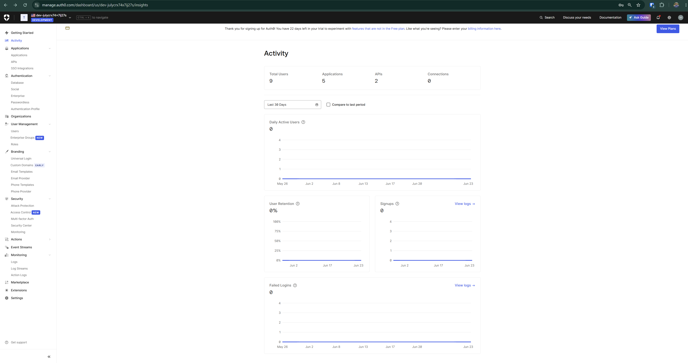
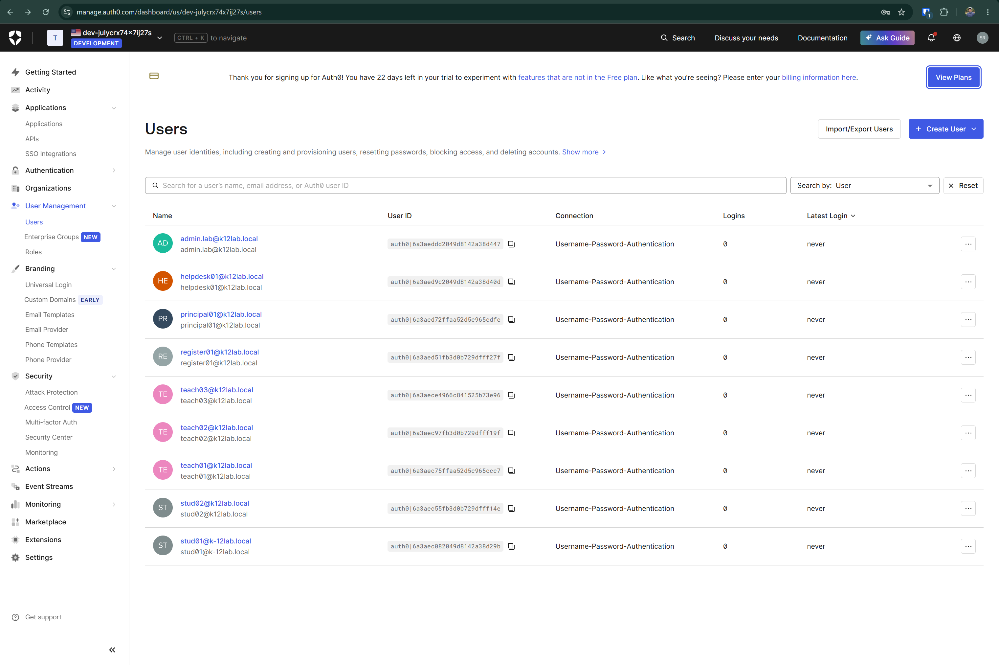
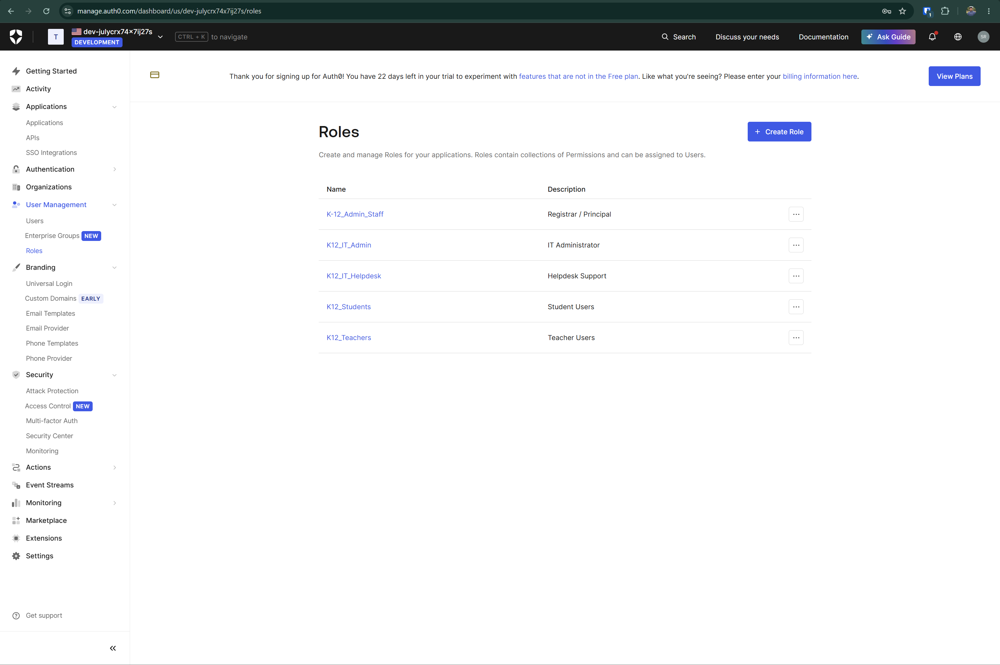
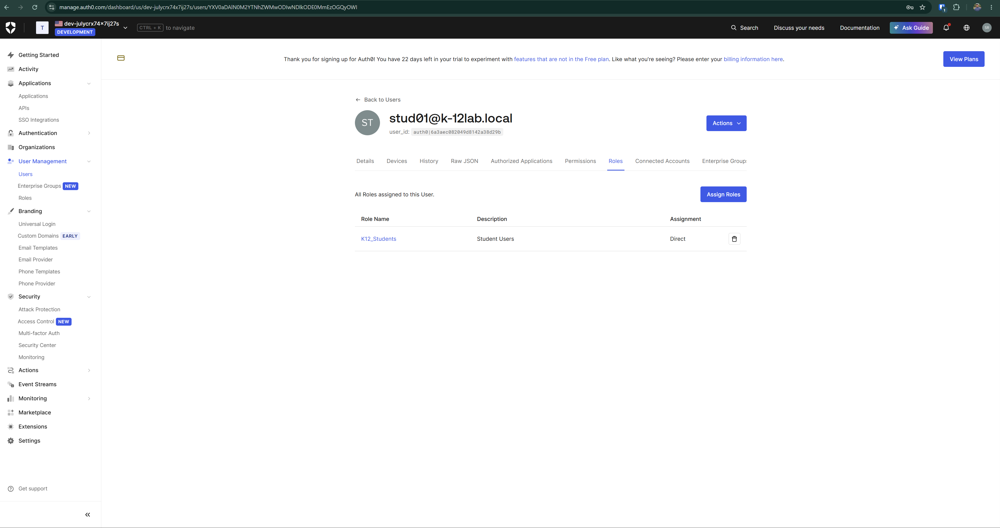
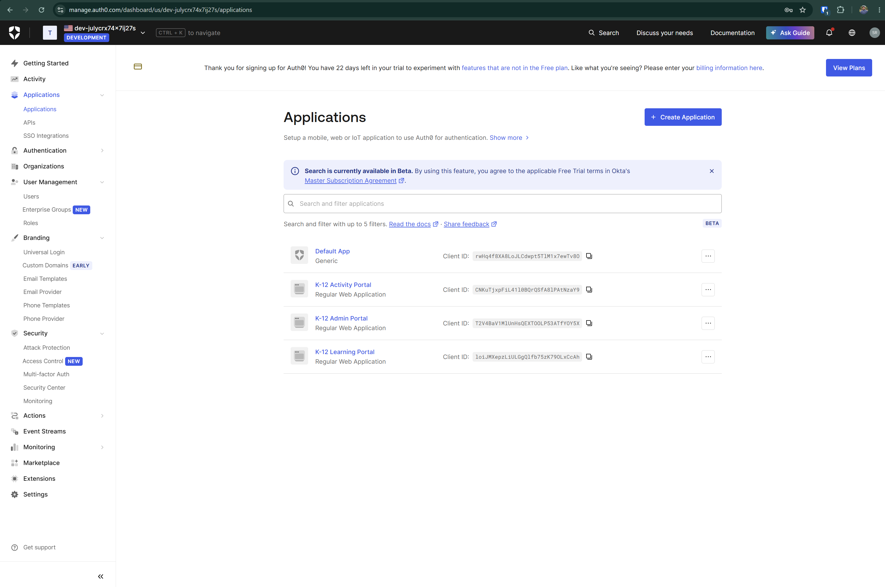
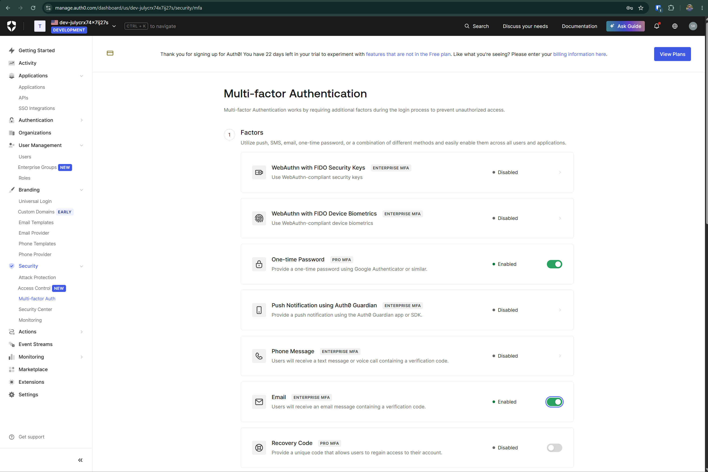
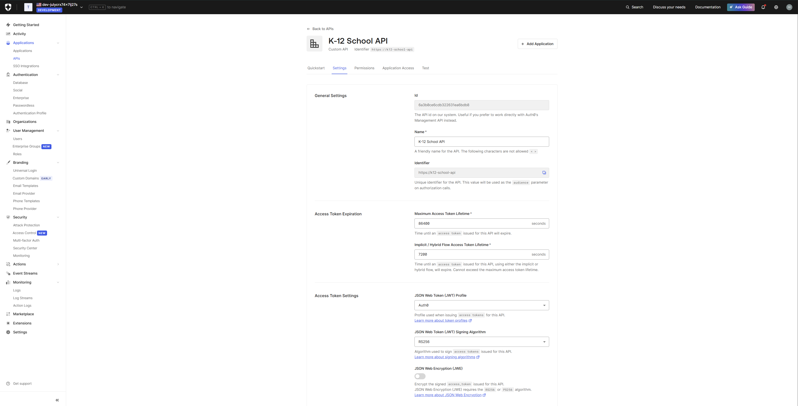
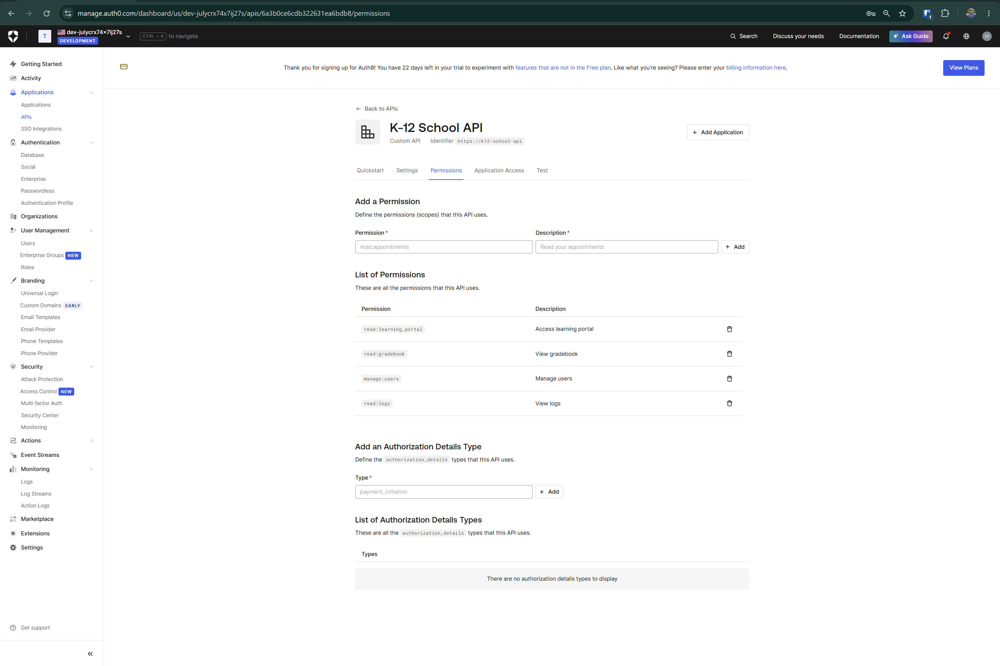
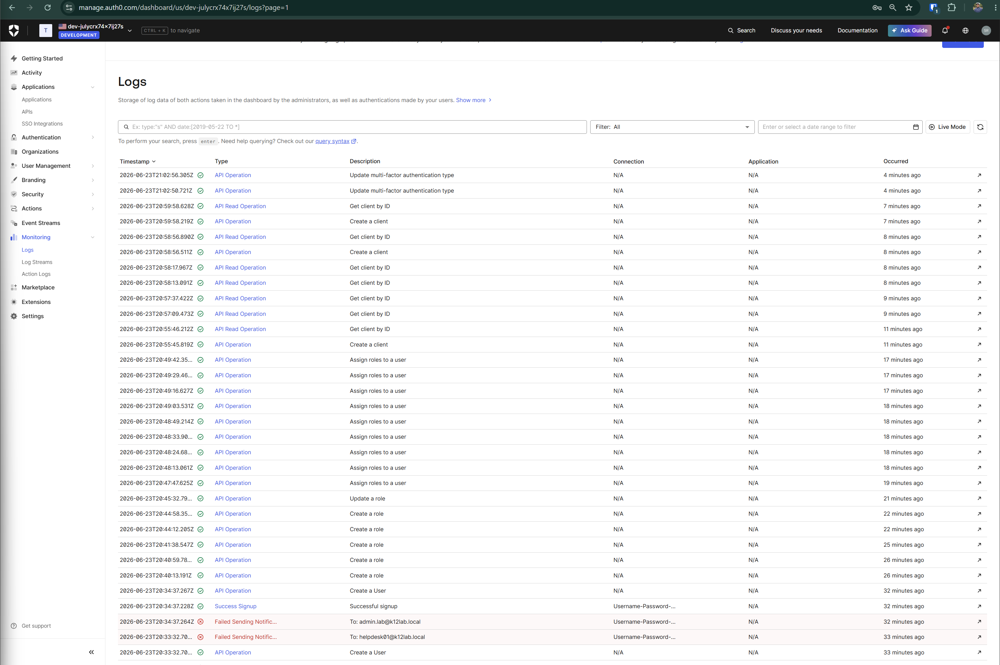

# Cloud-Based IAM User Management and RBAC Lab using Auth0

## Project Overview

This project demonstrates a cloud-based Identity and Access Management lab using Auth0. The lab simulates a small K-12 school environment where students, teachers, administrative staff, helpdesk users, and IT administrators require secure identity and access management.

The goal of this project is to reduce common identity risks such as weak authentication, excessive access, poor role separation, and limited visibility into user activity.

## Scenario

A small K-12 school wants to manage user identities and application access using a cloud IAM platform. The school needs different access levels for students, teachers, administrative staff, helpdesk users, and IT administrators.

This lab uses Auth0 to create users, assign roles, configure MFA, create sample applications, define API permissions, and review identity-related logs.

## Tools Used

- Auth0
- Auth0 User Management
- Auth0 Roles
- Auth0 Applications
- Auth0 APIs and Permissions
- Multi-factor Authentication
- Auth0 Monitoring Logs
- GitHub

## Lab Objectives

- Create test users for a K-12 school environment
- Create role-based access categories
- Assign users to appropriate roles
- Create sample school applications
- Create API permissions to represent access levels
- Enable MFA for stronger authentication
- Review logs for user activity and failed notification events
- Document the project with screenshots and a security control matrix

## Architecture Diagram

## Users and Roles

| User | Assigned Role |
|---|---|
| student01 | K12_Student |
| student02 | K12_Student |
| teacher01 | K12_Teacher |
| teacher02 | K12_Teacher |
| registrar01 | K12_Admin_Staff |
| principal01 | K12_Admin_Staff |
| helpdesk01 | K12_IT_Helpdesk |
| admin.lab | K12_IT_Admin |

## API Permissions

| Permission | Purpose |
|---|---|
| read:learning_portal | Allows access to the learning portal |
| read:gradebook | Allows access to gradebook-related resources |
| manage:users | Allows user management activities |
| read:logs | Allows log review and monitoring |

## Role-to-Permission Mapping

| Role | Permissions |
|---|---|
| K12_Student | read:learning_portal |
| K12_Teacher | read:learning_portal, read:gradebook |
| K12_Admin_Staff | read:gradebook |
| K12_IT_Helpdesk | manage:users |
| K12_IT_Admin | manage:users, read:logs |

## Security Controls Implemented

| Risk | Control Implemented | Security Benefit |
|---|---|---|
| Credential compromise | MFA | Reduces account takeover risk |
| Excessive access | Role-based access control | Limits access based on school role |
| Unauthorized API access | API permissions | Restricts access based on approved permissions |
| Poor visibility | Auth0 logs | Tracks user and system activity |
| Admin over-permissioning | Separate IT admin role | Supports least privilege |

## Screenshots

### Auth0 Dashboard

### Users List

### Roles List

### User Role Assignment

### Applications

### MFA Enabled

### API Created

### API Permissions

### System Logs

## Log Observation

Auth0 logs showed successful user creation and signup events. Some notification events failed because test lab email addresses were used instead of real mailboxes. This was expected in the lab environment and did not affect the IAM configuration.

## Key Takeaways

- Cloud IAM helps centralize user identity and access management.
- Role-based access control reduces excessive access.
- API permissions help enforce least privilege.
- MFA strengthens authentication security.
- Logs support monitoring, troubleshooting, and accountability.
- Test email notification failures can be identified through log review.

## Future Improvements

- Use verified test email addresses
- Add custom authentication policies
- Create a working demo login page
- Integrate logs with a SIEM tool
- Automate user creation using Auth0 APIs
